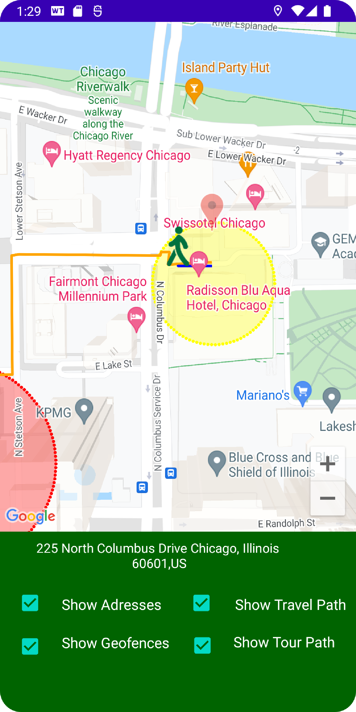
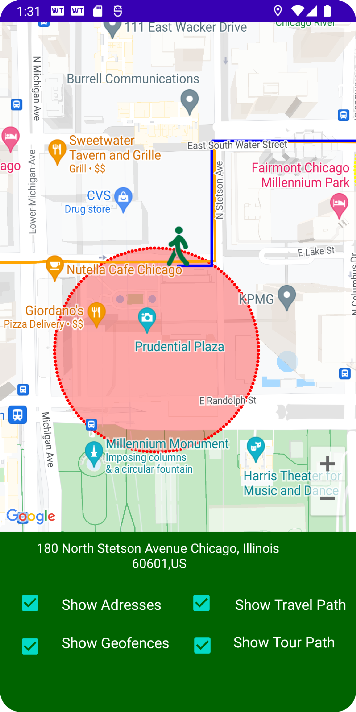
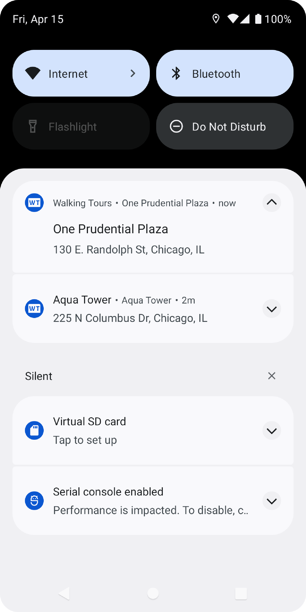

# WalkingToursApp

This app utilizes a Google Maps activity, the usage of geofences, and a location listener to provide the client with a walking tour through an area of Chicago across 
various hisotrical and tourist locations. 

The app is able to detect the client's latitude and longitude location and when the client enters a fenced zone alongside a tourist
site, a geofence is triggered and a notification is prompted with information related to the site. Clicking the notification opens a new screen showing the client the name,
address, photo, and general description of the app. 

Two polylines are traced along the route. One polyline is pre-loaded at runtime and consists of the route. The other polyline is traced as the client goes through the 
route. 

There is a bottom UI that enables the client to hide or enable different visual elements of the app. 

### Requirements to run the app

In order to run this app in a emulator setting, the route coordinates have to be downloaded and placed into the emulator's routes folder. The routes folder is located in 
this repository within the Route/WalkingTour folder. Both the .json and .pb files need to be placed within the android/locations/routes folder within the machine. 

### Android Studio Libraries and Techniques Used in the App

Google Maps Activity, Google Location Services, Location Listener, Geocoding, Geofencing, Full-screen, Custom Fonts

### Screen Shots

 

 

